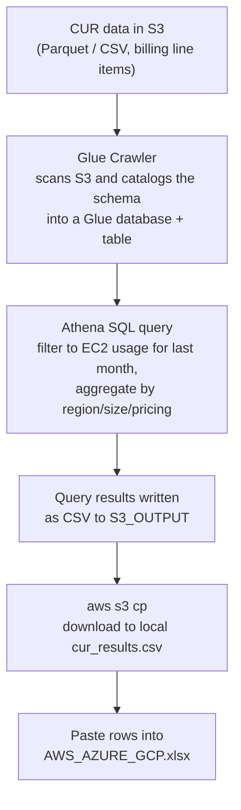

# AWS CUR Export Script for Cloud Cost Assessment

This script automates the extraction and analysis of AWS Cost and Usage Report (CUR) data for Cloud Cost Assessment (CCA) template requirements for cost advice.

## Overview

Two versions are available depending on your CUR configuration:

- **CUR 2.0 (Data Exports)**: Uses modern Parquet format with Resource IDs
- **Legacy CUR**: Uses traditional Athena-based CUR tables

## Version Comparison

| Feature | Legacy CUR | CUR 2.0 (Data Exports) |
|---------|------------|------------------------|
| Format | CSV/Gzip files | Parquet files |
| Resource IDs | Optional | Included by default |
| Script | `get-cca-export-cur-legacy.sh` | `get-cca-export.sh` |
| Query File | `cca-cur-query-legacy.sql` | `cca-cur-query.sql` |
| Approach | Glue Crawler + Athena | Glue Crawler + Athena |

## How the data flows



**Where the data comes from:** your **AWS Cost & Usage Report (CUR)** — the actual billing line items AWS already stores in S3. This is real metered billing data, not a live inventory scan.

**What we take in (input fields):**
- `line_item_availability_zone` -> Region (AZ letter stripped)
- `product_instance_type` -> Size
- `line_item_resource_id` -> counted for Quantity
- `line_item_usage_amount` -> summed for hours
- `pricing_purchase_option` -> Pricing Model
- Filters: `line_item_line_item_type = 'Usage'`, `line_item_product_code = 'AmazonEC2'`, `line_item_usage_type LIKE '%BoxUsage%'`, and `year`/`month` = the previous calendar month.

**How we transform it (in the Athena query):**
1. Keep only running-compute EC2 usage rows for last month.
2. Strip the trailing AZ letter so `us-east-1a` becomes region `us-east-1`.
3. `COUNT(DISTINCT line_item_resource_id)` -> **Quantity**.
4. `SUM(line_item_usage_amount)` -> **Total number of hours per month** (real hours).
5. Map `pricing_purchase_option` -> **Reserved / Spot / On-Demand**.
6. `GROUP BY` region + instance type + purchase option.

**What comes out:** a CSV in the exact CCA template column order (see below), downloaded locally and ready to paste into `AWS_AZURE_GCP.xlsx`.

## Output format

Both scripts write a CSV with exactly these columns (the CCA Portfolio Template columns, matching `AWS_AZURE_GCP.xlsx`):

| Cloud | Region | Size | Quantity | Total number of hours per month | Pricing Model |
|-------|--------|------|----------|---------------------------------|---------------|
| AWS | us-east-1 | m7a.xlarge | 5 | 3600 | On-Demand |
| AWS | eu-west-1 | r7a.2xlarge | 2 | 1460 | Reserved |

- **Region** is derived from the availability zone (the trailing AZ letter is stripped, e.g. `us-east-1a` -> `us-east-1`), matching the Region dropdown in Sheet2 of the template.
- **Size** is the EC2 instance type.
- **Quantity** = distinct `line_item_resource_id` values.
- **Total number of hours per month** = `SUM(line_item_usage_amount)` for the previous calendar month (this is REAL metered usage, unlike the Azure/GCP inventory estimates).
- **Pricing Model** = `Reserved`, `Spot`, or `On-Demand`.
- Output file: `cur_results.csv` (CUR 2.0) or `cur_legacy_results.csv` (Legacy).
- The template's optional leading `UUID` column is not produced; leave it blank on upload.

## Prerequisites

- AWS CLI installed and configured (`aws configure`)
- Appropriate AWS IAM permissions for S3, Glue, and Athena
- Active CUR configured in your AWS account, with data stored in an S3 bucket
- An IAM role for the Glue crawler (default name `AWSGlueServiceRole-crawler`) with access to the CUR S3 bucket
- The Glue database must already exist for CUR 2.0 (`get-cca-export.sh` creates the crawler but not the database). The legacy script (`get-cca-export-cur-legacy.sh`) creates the database automatically. Create it manually if needed:
  ```bash
  aws glue create-database --database-input '{"Name":"cur_reports"}' --region us-east-2
  ```

### For CUR 2.0:
- CUR 2.0 data exports with resource IDs enabled
- Data in Parquet format

### For Legacy CUR:
- Legacy CUR reports configured
- Data in CSV/Gzip format

## Configuration

Update these variables at the top of the script according to your environment.

### CUR 2.0 - `get-cca-export.sh`
```bash
REGION="us-east-2"                                     # AWS region
DATABASE_NAME="cur_reports"                            # Glue database (must already exist)
CRAWLER_NAME="cur_report_crawler"                      # Glue crawler name
S3_PATH="s3://your-bucket-name/your-cur-prefix/data/"  # Source CUR data path
S3_OUTPUT="s3://your-bucket-name/query_results/"       # Query results output path
ROLE_NAME="AWSGlueServiceRole-crawler"                 # IAM role used by the crawler
```

### Legacy CUR - `get-cca-export-cur-legacy.sh`
```bash
REGION="us-east-2"                                # AWS region
DATABASE_NAME="cur_legacy_reports"               # Glue database (created if missing)
CRAWLER_NAME="cur_legacy_crawler"                # Glue crawler name
S3_PATH="s3://your-bucket-name/your-cur-prefix/" # Source CUR data path
S3_OUTPUT="s3://your-bucket-name/query_results/" # Query results output path
ROLE_NAME="AWSGlueServiceRole-crawler"           # IAM role used by the crawler
```


## Usage

### Option 1: CUR 2.0 (Recommended for new deployments)

1. Download the script:
```bash
wget https://raw.githubusercontent.com/nfairoza/cloud-samples/refs/heads/main/cca-export/aws/get-cca-export.sh
```

2. Make the script executable:
```bash
chmod +x get-cca-export.sh
```

3. Run the script:
```bash
./get-cca-export.sh
```

### Option 2: Legacy CUR

1. Download the legacy script:
```bash
wget https://raw.githubusercontent.com/nfairoza/cloud-samples/refs/heads/main/cca-export/aws/get-cca-export-cur-legacy.sh
```

2. Make the script executable:
```bash
chmod +x get-cca-export-cur-legacy.sh
```

3. Run the script:
```bash
./get-cca-export-cur-legacy.sh
```

## Run in AWS CloudShell

AWS CloudShell has the AWS CLI preinstalled and uses your console credentials, so no local setup is needed.

1. Sign in to the [AWS Console](https://console.aws.amazon.com), pick the region that matches your `REGION` variable, and click the **CloudShell** icon (`>_`) in the top toolbar.
2. Upload the script: CloudShell **Actions → Upload file** → pick `get-cca-export.sh` (or the legacy script).
3. Run it:
   ```bash
   chmod +x get-cca-export.sh
   nano get-cca-export.sh    # set S3_PATH, S3_OUTPUT, REGION, etc.
   ./get-cca-export.sh
   ```
4. The results are downloaded to `cur_results.csv` in CloudShell; grab it via **Actions → Download file** → `cur_results.csv`.

Notes:
- Unlike the Azure/GCP inventory scripts, this requires a working CUR + S3 + Glue + Athena setup and an IAM role for the crawler — CloudShell does not remove those requirements.
- If you see a `bad interpreter: ^M` error (Windows line endings), run `sed -i 's/\r$//' get-cca-export.sh` and retry.

## Output

Both scripts generate a CSV file containing:
- Usage hours calculated from `line_item_usage_amount`
- Instance counts based on unique resource IDs (CUR 2.0) or usage patterns (Legacy)
- Usage hours aggregated by SKU
- Data formatted for CCA Portfolio Template upload

## Notes

- **Both scripts** use Glue crawler to catalog data, then query with Athena
- **CUR 2.0**: Works with Parquet format data from Data Exports
- **Legacy CUR**: Works with CSV/Gzip format from traditional CUR reports
- Both scripts download results locally and clean up intermediate files
- Ensure your IAM role has necessary permissions for S3, Athena, and Glue

## Choosing the Right Version

**Use CUR 2.0** if:
- You're setting up CUR for the first time
- You need resource-level tracking
- You want faster query performance with Parquet format

**Use Legacy CUR** if:
- You have existing CUR configured with Athena
- You're not ready to migrate to CUR 2.0
- Your organization has standardized on legacy CUR

## Additional Resources

- [AWS Cost and Usage Reports Documentation](https://docs.aws.amazon.com/cur/latest/userguide/)
- [CUR 2.0 Migration Guide](https://docs.aws.amazon.com/cur/latest/userguide/cur-data-exports.html)

## Support Files

- `cca-cur-query.sql` - Athena query for CUR 2.0 (reference copy of the query embedded in `get-cca-export.sh`)
- `cca-cur-query-legacy.sql` - Athena query for Legacy CUR (reference only)

> Note: the standalone `cca-cur-query-legacy.sql` uses slightly different column names (`purchase_option`, `record_type`) than the query actually embedded in `get-cca-export-cur-legacy.sh` (`pricing_term`, `reserved_instance_arn`, `line_item_type`). The embedded query is the one that runs; treat the `.sql` file as a starting point and adjust column names to match your CUR schema.
