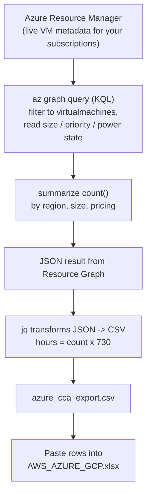

# Azure CCA Export

Extracts your Azure Virtual Machine inventory and formats it for the **Cloud Cost Assessment (CCA) Portfolio Template** so it can be pasted straight into `AWS_AZURE_GCP.xlsx`.

## Output format

The script writes a CSV with exactly these columns (the CCA template columns):

| Cloud | Region | Size | Quantity | Total number of hours per month | Pricing Model |
|-------|--------|------|----------|---------------------------------|---------------|
| Azure | eastus | Standard_D2s_v3 | 4 | 2920 | On-Demand |
| Azure | westeurope | Standard_E4s_v5 | 2 | 1460 | Spot |

- **Region** is emitted in Azure short-code form (`eastus`, `westeurope`, `uksouth`, ...), which matches the Region dropdown values in `AWS_AZURE_GCP.xlsx` (Sheet2).
- **Size** is the Azure VM size name (`Standard_D2s_v3`, `Standard_E4s_v5`, ...).
- **Quantity** is the number of VMs of that size/region/pricing.
- **Total number of hours per month** = `Quantity x 730` (a full-month estimate — see [Limitations](#limitations)).
- **Pricing Model** is `Spot` or `On-Demand` (see [Limitations](#limitations) about Reserved).
- The template's optional leading `UUID` column is **not** produced; the CCA portal assigns it. Leave it blank on upload.

---

## How the data flows



**Where the data comes from:** **Azure Resource Graph**, which queries the live metadata of your VM resources across every subscription you can see. This is an **inventory scan** (what exists right now), not billing data — so there are no real "hours," which is why we estimate them.

**What we take in (per VM):**
- `location` -> Region (already an Azure short code like `eastus`)
- `properties.hardwareProfile.vmSize` -> Size (e.g. `Standard_D2s_v3`)
- `properties.priority` -> Spot vs On-Demand
- `properties.extended.instanceView.powerState.code` -> power state (only used if `RUNNING_ONLY="true"`)

**How we transform it:**
1. Filter to `microsoft.compute/virtualmachines` (optionally only powered-on VMs).
2. Derive `pricing = Spot` if `priority == 'Spot'`, else `On-Demand`.
3. `summarize count()` grouped by region + size + pricing -> **Quantity**.
4. `jq` multiplies each count by `HOURS_PER_MONTH` (730) -> **Total number of hours per month** (estimate).
5. Emit rows in the CCA column order.

**What comes out:** `azure_cca_export.csv` in the exact CCA template columns, ready to paste into `AWS_AZURE_GCP.xlsx`.

## Which approach should I use?

| Approach | Script | Needs setup? | Accuracy |
|----------|--------|--------------|----------|
| **Resource Graph (inventory)** — recommended | `get-cca-export.sh` | None (just `az login`) | Exact VM counts/sizes/regions; hours estimated at 730 |
| **Cost Management (billing)** — advanced | see [Advanced](#advanced-billing-accurate-hours) | Requires cost data / exports | Real metered hours, but messier sizes/regions |

Start with `get-cca-export.sh`. It works immediately on any subscription with no billing configuration.

---

## Prerequisites

1. **Azure CLI (`az`)** installed
   - Windows: https://learn.microsoft.com/cli/azure/install-azure-cli-windows
   - macOS: `brew install azure-cli`
   - Linux: https://learn.microsoft.com/cli/azure/install-azure-cli-linux
2. **`jq`** installed (JSON processor used to build the CSV)
   - Windows (winget): `winget install jqlang.jq`
   - macOS: `brew install jq`
   - Linux: `sudo apt-get install jq`
3. **A Bash shell** to run the script
   - Windows: use **Git Bash** or **WSL** (the script is Bash, not PowerShell).
4. **Log in** and confirm your subscription:
   ```bash
   az login
   az account show          # confirms the active subscription
   az account list -o table # lists all subscriptions you can see
   ```

> The `resource-graph` CLI extension is installed automatically by the script the first time it runs. To do it manually: `az extension add --name resource-graph`.

### Permissions
You need at least **Reader** on the subscription(s) you want to scan. Resource Graph only reads metadata — the script makes no changes to your environment.

---

## Configuration variables

Edit the block at the top of `get-cca-export.sh`:

| Variable | Default | What it does |
|----------|---------|--------------|
| `SUBSCRIPTION_ID` | `""` (empty) | Empty = scan **all** subscriptions you can access. Set to a subscription GUID (from `az account list`) to scope to one. |
| `HOURS_PER_MONTH` | `730` | Multiplier used to estimate monthly runtime hours per VM. |
| `RUNNING_ONLY` | `"false"` | `"true"` counts only powered-on VMs; `"false"` counts every VM (best for a first run). |
| `OUTPUT_FILE` | `./azure_cca_export.csv` | Path of the generated CSV. |

---

## Usage

```bash
# 1. Make the script executable (first time only)
chmod +x get-cca-export.sh

# 2. (Optional) edit SUBSCRIPTION_ID / RUNNING_ONLY at the top of the file

# 3. Run it
./get-cca-export.sh
```

You'll get `azure_cca_export.csv` in the current folder and a preview printed to the terminal. Open the CSV and copy the rows into the `AWS_AZURE_GCP.xlsx` template (or upload the CSV to the CCA portal).

---

## Run in Azure Cloud Shell (easiest — no local install)

Cloud Shell already has `az` and `jq`, and you're auto-authenticated, so you can skip the Prerequisites entirely.

1. Open [portal.azure.com](https://portal.azure.com) and click the **`>_`** (Cloud Shell) icon in the top bar. Choose **Bash** if prompted.
2. Upload the script: Cloud Shell toolbar → **Upload/Download files → Upload** → pick `get-cca-export.sh`.
3. Run it:
   ```bash
   chmod +x get-cca-export.sh
   nano get-cca-export.sh    # optional: set SUBSCRIPTION_ID (else all subs are scanned)
   ./get-cca-export.sh
   ```
4. Download the result: **Upload/Download files → Download** → type `azure_cca_export.csv`.

Notes:
- No `az login` needed — you're already signed in. Confirm the active subscription with `az account show`.
- The `resource-graph` extension may not be preinstalled; the script installs it automatically.
- If you see a `bad interpreter: ^M` error (Windows line endings), run `sed -i 's/\r$//' get-cca-export.sh` and retry.

---

## Get this data from the portal (no CLI)

Azure's **Resource Graph Explorer** runs the same query in the browser — the fastest option of any cloud (Reader access only, no install, no Cloud Shell).

1. In the [portal](https://portal.azure.com), search for **Resource Graph Explorer**.
2. Paste this KQL (it emits the CCA columns directly, hours estimated at 730):
   ```kql
   Resources
   | where type =~ 'microsoft.compute/virtualmachines'
   | extend Size = tostring(properties.hardwareProfile.vmSize)
   | extend priority = tostring(properties.priority)
   | extend PricingModel = iff(priority =~ 'Spot', 'Spot', 'On-Demand')
   | summarize Quantity = count() by Region = location, Size, PricingModel
   | extend Cloud = 'Azure', ['Total number of hours per month'] = Quantity * 730
   | project Cloud, Region, Size, Quantity, ['Total number of hours per month'], PricingModel
   | order by Size asc, Region asc
   ```
3. Set the scope (a subscription, or "Directory" for all) in the top bar, then click **Run query**.
4. Click **Download as CSV** → paste into `AWS_AZURE_GCP.xlsx`.

> Same data as `get-cca-export.sh` — use whichever you prefer. For real billing hours instead of the 730 estimate, see [Advanced](#advanced-billing-accurate-hours).

---

## How it works

1. Verifies `az` / `jq` are installed and that you're logged in.
2. Installs the `resource-graph` extension if missing.
3. Runs this Azure Resource Graph (KQL) query across the chosen scope:
   ```kql
   Resources
   | where type =~ 'microsoft.compute/virtualmachines'
   | extend size = tostring(properties.hardwareProfile.vmSize)
   | extend priority = tostring(properties.priority)
   | extend pricing = iff(priority =~ 'Spot', 'Spot', 'On-Demand')
   | summarize Quantity = count() by location, size, pricing
   ```
4. Converts the JSON result into the CCA CSV column layout with `jq`, multiplying the count by `HOURS_PER_MONTH`.

---

## Limitations

- **Hours are estimated.** Inventory has no metered runtime, so hours = `count x 730`. For exact hours use the [Advanced](#advanced-billing-accurate-hours) approach.
- **Reserved Instances / Savings Plans are invisible here.** They are billing constructs, not VM properties, so reserved VMs show as `On-Demand`. Spot VMs *are* detected (`properties.priority == 'Spot'`).
- **VM Scale Sets (VMSS) are excluded.** Only standalone `microsoft.compute/virtualmachines` are counted. If you use VMSS heavily, tell me and I'll add `microsoft.compute/virtualmachinescalesets` handling.
- **1000-row cap.** Resource Graph returns up to 1000 grouped rows per page. The script warns if you exceed it (very unlikely for grouped output).

---

## Advanced: billing-accurate hours

Azure has no single "billing table" you can query like AWS CUR or GCP BigQuery unless you set up exports. Two options if you need real metered hours:

### Option A — quick `az costmanagement query` (real hours by region + meter)
Cost Management's Query API allows **at most 2 groupings**, so it can give hours per region + meter but not clean per-instance counts. Use it to sanity-check the estimate:

```bash
az extension add --name costmanagement   # first time only

az costmanagement query \
  --type ActualCost \
  --scope "/subscriptions/<YOUR_SUBSCRIPTION_ID>" \
  --timeframe TheLastMonth \
  --dataset-aggregation '{"totalHours":{"name":"UsageQuantity","function":"Sum"}}' \
  --dataset-grouping name ResourceLocation \
  --dataset-grouping name Meter \
  --dataset-filter '{"dimensions":{"name":"MeterCategory","operator":"In","values":["Virtual Machines"]}}' \
  -o json
```
Caveats: some VM meters are billed in units of "10 Hours"/"100 Hours" (so `UsageQuantity` is not always 1:1 with hours), and `ResourceLocation` may come back as a display name (`US East`) rather than `eastus`.

### Option B — scheduled Cost Management export (most accurate, more setup)
Configure **Cost Management > Exports** to write daily/monthly usage (with the `PricingModel` and `ResourceId` columns) to a storage account, then query the CSV/Parquet. This mirrors the AWS CUR workflow. Docs: https://learn.microsoft.com/azure/cost-management-billing/costs/tutorial-improved-exports

If you want, I can turn either option into a full script once you confirm your setup.

---

## Troubleshooting

| Symptom | Fix |
|---------|-----|
| `You are not logged in` | Run `az login`. |
| `'jq' is not installed` | Install jq (see Prerequisites). |
| Empty CSV (header only) | You may have no standalone VMs in scope, or all are VMSS. Try `RUNNING_ONLY="false"` and confirm with `az vm list -o table`. |
| Wrong subscription | Set `SUBSCRIPTION_ID`, or run `az account set --subscription <id>`. |
| `1000 grouped rows` warning | Contact me to add `--skip-token` paging; rarely needed for grouped data. |
| Region shows unexpected value | ARG returns Azure short codes; verify against Sheet2 of the template. |
