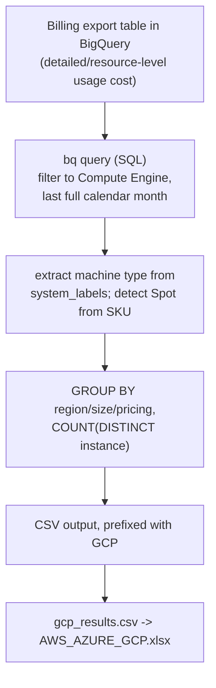
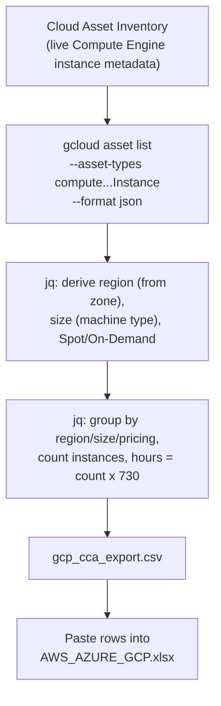

# GCP CCA Export

Extracts your Google Compute Engine instances and formats them for the **Cloud Cost Assessment (CCA) Portfolio Template** so the data can be pasted straight into `AWS_AZURE_GCP.xlsx`.

## Output format

Both scripts write a CSV with exactly these columns (the CCA template columns):

| Cloud | Region | Size | Quantity | Total number of hours per month | Pricing Model |
|-------|--------|------|----------|---------------------------------|---------------|
| GCP | us-central1 | n2-standard-4 | 3 | 2190 | On-Demand |
| GCP | europe-west1 | e2-standard-8 | 1 | 730 | Spot |

- **Region** is emitted in GCP short-code form (`us-central1`, `europe-west1`, ...), which matches the Region dropdown values in `AWS_AZURE_GCP.xlsx` (Sheet2).
- **Size** is the machine type (`n2-standard-4`, `e2-standard-8`, custom types, ...).
- **Quantity** is the number of instances of that machine type/region/pricing.
- **Total number of hours per month** = `Quantity x 730` (a full-month estimate — see [Limitations](#limitations)).
- **Pricing Model** is `Spot` or `On-Demand` (see [Limitations](#limitations) about Committed Use).
- The template's optional leading `UUID` column is **not** produced; leave it blank on upload.

---

## How the data flows

There are two data sources depending on which script you run.

### Option 1 — BigQuery billing export (✅ recommended: real data)



**Where the data comes from:** your **BigQuery billing export** (real billing rows for the month). This sees every instance that actually ran during the month — including ones created or deleted mid-month — and detects Spot accurately from the SKU. Prefer this whenever you have billing export access. (Hours are still `count × 730` because GCP bills per vCPU/GB, not per instance-hour, but the instance set and regions are real.)

**What we take in:** `location.region`, `system_labels['compute.googleapis.com/machine_spec']` (Size), `resource.name` (counted), `sku.description` (Spot detection), `usage_start_time` (last-month filter), filtered to `service.description = 'Compute Engine'`.

### Option 2 — Cloud Asset Inventory (fallback: snapshot estimate)



**Where the data comes from:** **Cloud Asset Inventory** — a **point-in-time snapshot** of the Compute Engine instances that exist *at the moment you run it*. It is **not** month-spanning: a VM that ran for three weeks but was deleted before you run this is invisible, and a VM created today is counted as if it ran all month. Hours are a pure estimate (`count × 730`). Use only when you can't get billing access, and treat the output as a rough guess.

**What we take in (per instance):**
- `zone` -> Region (`.../zones/us-central1-a` becomes `us-central1`)
- `machineType` -> Size (`n2-standard-4`)
- `scheduling.provisioningModel` / `scheduling.preemptible` -> Spot vs On-Demand
- `status` -> only used if `RUNNING_ONLY="true"`

**How we transform it (in `jq`):** parse each instance, group by region + size + pricing to get **Quantity**, then multiply by `HOURS_PER_MONTH` (730) for **Total number of hours per month**.

**What comes out (both options):** a CSV in the exact CCA template columns, ready to paste into `AWS_AZURE_GCP.xlsx`.

## Which script should I use?

**Prefer real billing data.** If you have (or can set up) a BigQuery billing export, use it — it reports the actual month's usage, not a guess. Fall back to the inventory snapshot only when you can't get billing access.

| Approach | Script | Needs setup? | Accuracy |
|----------|--------|--------------|----------|
| **BigQuery billing export** — ✅ recommended | `get-cca-export.sh` | Requires billing export to BigQuery | **Real billing data**: actual instances seen during the month, accurate Spot detection. (Hours are still count×730 — GCP bills per vCPU/GB, not per instance-hour.) |
| **Cloud Asset Inventory** — fallback (no billing access) | `get-cca-export-asset-730.sh` | None (just `gcloud auth login`) | **Point-in-time snapshot** of VMs that exist *right now*, hours **estimated** at ×730. Misses anything created/deleted mid-month; assumes 24/7 uptime. A guess, not measured data. |

Start with **`get-cca-export.sh`** (billing) whenever billing export is available. Use `get-cca-export-asset-730.sh` only as a quick, no-setup fallback — and treat its numbers as an estimate.

---

## Prerequisites (both scripts)

1. **Google Cloud SDK** (`gcloud`, `bq`, `gsutil`) installed and authenticated
   - Install: https://cloud.google.com/sdk/docs/install
   - Authenticate:
     ```bash
     gcloud auth login
     gcloud config set project <YOUR_PROJECT_ID>
     ```
2. **`jq`** installed (used by the asset-inventory script)
   - Windows (winget): `winget install jqlang.jq`
   - macOS: `brew install jq`
   - Linux: `sudo apt-get install jq`
3. **A Bash shell** (Windows: Git Bash or WSL — the scripts are Bash, not PowerShell).

### Permissions
- **Asset Inventory script:** `roles/cloudasset.viewer` (or `roles/viewer`) on the project. The script auto-enables the Cloud Asset API if needed.
- **BigQuery script:** `roles/bigquery.dataViewer` + `roles/bigquery.jobUser` on the billing project/dataset.

---

## Option 1 (✅ recommended): BigQuery billing export

Real billing data for the month. Use this whenever you have a **Detailed usage cost** export to BigQuery (or can set one up):
https://cloud.google.com/billing/docs/how-to/export-data-bigquery-setup

### Configuration variables — `get-cca-export.sh`

| Variable | Default | What it does |
|----------|---------|--------------|
| `PROJECT_ID` | `your-gcp-project-id` | **Required.** Project that owns the billing dataset. |
| `DATASET_NAME` | `billing_data` | **Required.** BigQuery dataset holding the export. |
| `BILLING_TABLE` | `gcp_billing_export_resource_v1_...` | **Required.** The **detailed** (resource-level) export table. Find it with `bq ls <PROJECT>:<DATASET>`. |
| `HOURS_PER_MONTH` | `730` | Multiplier for the hours estimate. |
| `OUTPUT_FILE` | `./gcp_results.csv` | Path of the generated CSV. |

> **Important:** you must use the **resource-level** export table (`..._resource_v1_...`). The size column comes from `system_labels['compute.googleapis.com/machine_spec']`, which only exists in the detailed export — not the standard (`..._v1_...`) one.

### Run it
```bash
chmod +x get-cca-export.sh
# edit PROJECT_ID / DATASET_NAME / BILLING_TABLE at the top of the file
./get-cca-export.sh
```

### How it works
Runs a BigQuery query over the last full calendar month that filters to `Compute Engine`, extracts the machine type from `system_labels`, groups by region/size/pricing, counts distinct instances, and writes the CCA CSV (prefixing each row with `GCP`).

> **Just want the query?** The same SQL is available as a standalone file, [`cca-query.sql`](cca-query.sql), ready to paste into **BigQuery Studio** in the browser — no CLI, `bq`, or Bash needed. Replace the `PROJECT_ID.DATASET.TABLE` placeholder, run it, and download the result as CSV.

---

## Option 2 (fallback, no billing access): Cloud Asset Inventory

Use this only when you can't get a BigQuery billing export. It's a **point-in-time snapshot** (VMs that exist right now), and the hours are an **estimate** (`count × 730`) — see the warning below.

### Configuration variables — `get-cca-export-asset-730.sh`

| Variable | Default | What it does |
|----------|---------|--------------|
| `PROJECT_ID` | `your-gcp-project-id` | **Required.** The project to scan. |
| `HOURS_PER_MONTH` | `730` | Multiplier used to estimate monthly runtime hours. |
| `RUNNING_ONLY` | `"false"` | `"true"` counts only `RUNNING` instances; `"false"` counts all. |
| `OUTPUT_FILE` | `./gcp_cca_export.csv` | Path of the generated CSV. |

### Run it
```bash
chmod +x get-cca-export-asset-730.sh
# edit PROJECT_ID at the top of the file
./get-cca-export-asset-730.sh
```

### How it works
1. Checks `gcloud`/`jq`, confirms you're authenticated, sets the project.
2. Enables `cloudasset.googleapis.com` if it isn't already.
3. Lists instances: `gcloud asset list --asset-types=compute.googleapis.com/Instance`.
4. Uses `jq` to derive region (from the zone), machine type, and Spot vs On-Demand (`scheduling.provisioningModel`/`preemptible`), groups them, and writes the CCA CSV with `hours = count x 730`.

> ⚠️ **This is a snapshot, not the month.** It captures only the VMs that exist at the instant you run it. Any VM created or deleted mid-month is mis-counted (or missed entirely), and every counted VM is assumed to have run 24/7. The hours column is a guess — for real numbers use Option 1 (billing).

---

## Run in GCP Cloud Shell (easiest — no local install)

Cloud Shell already has `gcloud`, `bq`, and `jq`, and you're auto-authenticated, so you can skip the Prerequisites entirely.

1. Open [console.cloud.google.com](https://console.cloud.google.com) and click the **`>_`** (Activate Cloud Shell) icon top-right.
2. Upload the script: Cloud Shell **⋮ (three-dot menu) → Upload** → pick `get-cca-export-asset-730.sh` (or `get-cca-export.sh`).
3. Run it:
   ```bash
   chmod +x get-cca-export-asset-730.sh
   nano get-cca-export-asset-730.sh   # set PROJECT_ID to your project
   ./get-cca-export-asset-730.sh
   ```
4. Download the result: Cloud Shell **⋮ → Download** → type `gcp_cca_export.csv`.

Notes:
- No `gcloud auth login` needed — you're already signed in. Set the project with `gcloud config set project <YOUR_PROJECT_ID>` (or just set `PROJECT_ID` in the script).
- The script auto-enables the Cloud Asset API if needed.
- If you see a `bad interpreter: ^M` error (Windows line endings), run `sed -i 's/\r$//' get-cca-export-asset-730.sh` and retry.

---

## Get this data from the portal (no CLI)

### Option A — BigQuery Studio (✅ recommended; real data, needs billing export)
1. Console → **BigQuery → Studio** (SQL editor in the browser).
2. Open [`cca-query.sql`](cca-query.sql), replace the `PROJECT_ID.DATASET.TABLE` placeholder with your billing export table, paste it in, and **Run**. (This is the same query embedded in `get-cca-export.sh`, provided as a standalone file so you don't need the CLI or Bash.)
3. **Save results → CSV / Google Sheets** → paste into `AWS_AZURE_GCP.xlsx`.

### Option B — Cloud Asset Inventory (fallback; instant snapshot, hours estimated)
1. Console → **IAM & Admin → Asset Inventory** (enable the Cloud Asset API if prompted).
2. On the **Resources** tab, filter **Asset type = `compute.googleapis.com/Instance`**.
3. Click **Export** (CSV or to BigQuery). Gives current instances (zone/machine type) → Quantity by region/size; hours are estimated at 730. ⚠️ Snapshot only — misses VMs created/deleted mid-month.

**Quick CLI equivalent** (inventory, no billing export):
```bash
gcloud compute instances list \
  --format="csv(zone.basename(), machineType.basename(), status)"
```

---

## Limitations

- **Hours are estimated at `count x 730`** in *both* scripts. GCP bills per vCPU/GB, not per instance-hour, so a true per-instance-hour value isn't directly available even from billing. (AWS, by contrast, has real metered hours.)
- **The Asset Inventory script (`-asset-730`) is a point-in-time snapshot, not the month.** It counts only VMs that exist when you run it — mid-month create/delete is missed, and everything is assumed to run 24/7. The BigQuery script at least sees the real set of instances that ran *during* the month. Prefer billing whenever possible.
- **Committed Use Discounts (Reserved) are not detected.** CUDs are applied as billing credits, so committed instances appear as `On-Demand`. Spot/Preemptible instances **are** detected.
- **Asset script scans one project at a time.** For an organization-wide view, run per project (or ask me to switch it to `gcloud asset list --scope=organizations/<ORG_ID>`).
- **BigQuery script needs the detailed export** (see note above) or the `Size` column will be empty.

---

## Troubleshooting

| Symptom | Fix |
|---------|-----|
| `No active gcloud account` | Run `gcloud auth login`. |
| `'jq' is not installed` | Install jq (see Prerequisites). |
| Empty CSV (header only) | No instances in the project, or `RUNNING_ONLY="true"` filtered them out. Check `gcloud compute instances list`. |
| `Dataset ... not found` (BigQuery) | Billing export isn't set up, or wrong `PROJECT_ID`/`DATASET_NAME`. |
| `Size` column empty (BigQuery) | You're pointing at the standard export; switch to the `..._resource_v1_...` table. |
| Region looks wrong | Scripts emit GCP short codes; verify against Sheet2 of the template. |
