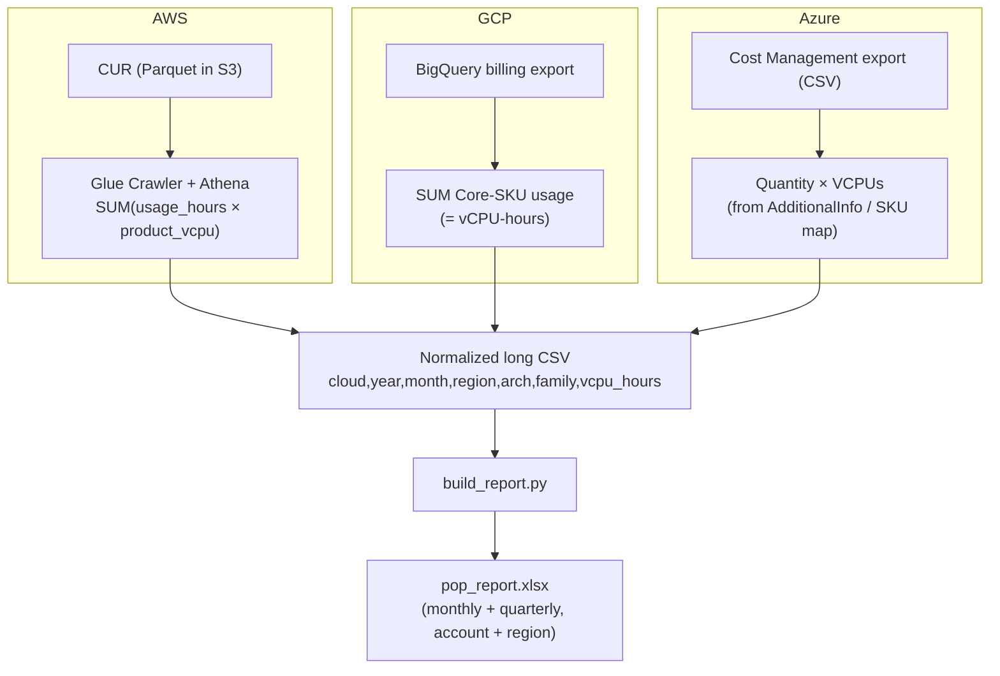

# Proof of Performance (vCPU migration report)

Measures **how many vCPUs a customer has running on each CPU vendor/architecture — Intel, AMD, and ARM — over the last 12 months**, month by month and quarter by quarter, at the account level and broken down by region.

The goal is a *proof of performance / migration* story: how much compute has actually moved onto AMD (from Intel **and** from ARM/Graviton), backed by the customer's own billing data.

---

## What you get

A single Excel workbook (`pop_report.xlsx`) with these sheets:

| Sheet | Rows | Purpose |
|-------|------|---------|
| **About** | — | Legend + metric definitions |
| **Account-Monthly** | one per cloud × month | Overall trend, month by month |
| **Region-Monthly** | one per cloud × region × month | Same, split by region |
| **Account-Quarterly** | one per cloud × quarter | Quarter roll-up (so a mid-quarter run still shows complete quarters) |
| **Region-Quarterly** | one per cloud × region × quarter | Quarter roll-up by region |
| **Family-Detail** | per cloud/region/month/arch/family | Drill-down to instance family (m7a, c7g, n2d, D2as…) |

Each sheet reports **two metrics per bucket**:
- **vCPU-hrs** — `SUM(instance-hours × vCPUs per instance)`; the true consumption number.
- **avg vCPUs** — `vCPU-hrs ÷ hours in the period`; the average number of vCPUs running concurrently (the intuitive "how many vCPUs", automatically prorated for part-month usage).

Plus **AMD %** and **ARM %** of total vCPU-hours per row so the migration trend is obvious.

### Why two metrics? (the vCPU math)
- One `m7a.2xlarge` = 8 vCPUs. Running 100 hours → **800 vCPU-hours** (8 × 100). This does **not** double count — the hours already carry the time dimension.
- If it runs the full month (730h) → 5,840 vCPU-hrs ÷ 730 = **8 avg vCPUs**, i.e. exactly the intuitive count. Run half the month → 4. That's the honest, time-weighted headcount.

> Want *peak* concurrent vCPUs instead of average? That needs CloudWatch/Monitor metrics, not billing data — ask and it can be added.

---

## Architecture buckets

Instances are classified purely by the **silicon vendor**, inferred from the instance/machine name:

| Bucket | AWS | Azure | GCP |
|--------|-----|-------|-----|
| **AMD** | `*a` families (m7a, r7a, c6a, hpc7a…) | `*a*` sizes (D2as_v5, E4as_v5…) | N2D, C2D, T2D, C3D |
| **ARM** | Graviton `*g` families (m7g, c7gn, t4g, a1) | `*p*` sizes / Ampere (D2ps_v5…) | T2A, C4A (Axion), Tau |
| **Intel** | everything else (m7i, c6i, m5, r5n…) | everything else (D2s_v5, E4s_v5…) | N1, N2, C2, C3, E2, M-series |

(Reserved/committed capacity is **not** a separate bucket — this measures the vendor of the chip, which is what proof-of-performance cares about.)

---

## How the data flows



Every cloud script emits the **same normalized CSV schema**, and the shared `build_report.py` turns one or more of them into the Excel report. You can run one cloud or combine all three:

```bash
python3 build_report.py aws_pop_long.csv gcp_pop_long.csv azure_pop_long.csv -o pop_report.xlsx
# or simply:
python3 build_report.py *_pop_long.csv -o pop_report.xlsx
```

---

## Normalized CSV contract

Every per-cloud script produces this (one row per group):

```
cloud,year,month,region,arch,family,vcpu_hours
AWS,2025,8,us-east-1,AMD,m7a,146000
AWS,2025,8,us-east-1,Intel,m6i,730000
GCP,2025,8,us-central1,AMD,n2d,50000
Azure,2025,8,eastus,ARM,D2ps,12000
```

---

## Quick start

1. Pick your cloud folder and follow its `README.md`:
   - [`aws/`](aws/README.md) — CUR + Glue + Athena (same method as `../cca-export/aws`)
   - [`gcp/`](gcp/README.md) — BigQuery billing export
   - [`azure/`](azure/README.md) — Cost Management export CSVs
2. Each script writes a `*_pop_long.csv` and (if `python3` + `openpyxl` are present) builds `pop_report.xlsx` automatically.
3. To combine clouds, gather the `*_pop_long.csv` files in one folder and run `build_report.py` over all of them.

### Requirements
- `python3` with `openpyxl` for the Excel step: `pip install --user openpyxl`
- Cloud-specific CLIs/data — see each folder's README.
- Runs great in each cloud's **Cloud Shell** (CLIs + python3 preinstalled).

---

## Status / accuracy notes

- **AWS** — most robust: CUR exposes `product_vcpu` directly, so vCPU-hours are exact.
- **GCP** — robust: GCP prices per vCPU, so the "Core" SKU usage *is* vCPU-hours.
- **Azure** — needs a Cost Management export configured first (no live billing table exists). vCPUs come from the export's `AdditionalInfo`, or a `az vm list-skus` map. Validate against your data on first run and report back any column-name differences.
