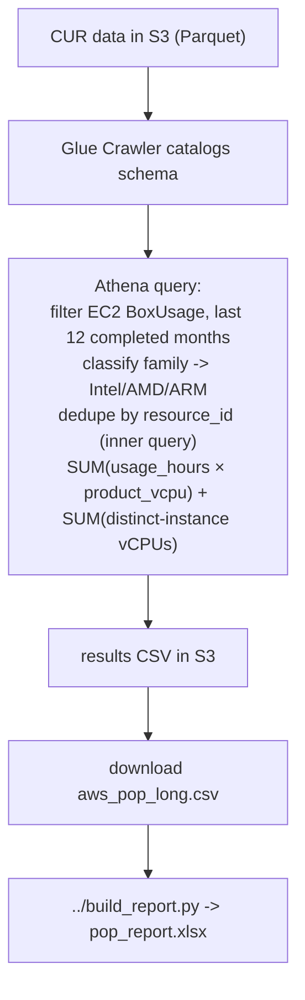

# Proof of Performance — AWS

Pulls 12 months of EC2 usage from your **Cost & Usage Report (CUR 2.0 / Data Exports)**, classifies every instance family as **Intel / AMD / ARM (Graviton)**, and produces vCPU-hours per month/region/family. Same Glue + Athena methodology as [`../../cca-export/aws`](../../cca-export/aws).

## Output

A normalized CSV (`aws_pop_long.csv`):

```
cloud,year,month,region,arch,family,vcpu_hours,vcpus
AWS,2025,8,us-east-1,AMD,m7a,146000,200
AWS,2025,8,us-east-1,Intel,m6i,730000,1000
```

- **vcpu_hours** = `SUM(usage_hours × product_vcpu)` — time-weighted consumption.
- **vcpus** = **provisioned vCPUs** that month = sum over **distinct** `line_item_resource_id`s of each instance's `product_vcpu`. A real headcount (count × size), deduped so an instance billed on many rows counts once.

If `python3` + `openpyxl` are available, it also builds `pop_report.xlsx` (see the [top-level README](../README.md) for the sheet layout).

## How the data flows



- **vCPU-hours** = `SUM(line_item_usage_amount × product_vcpu)` — CUR provides the vCPU count per instance type directly, so this is exact.
- **Provisioned vCPUs** (`vcpus`) = the query first collapses to one row per instance (`GROUP BY … resource_id`), then sums each distinct instance's `product_vcpu` — so an instance appearing on many usage rows is counted **once**. Real count, not a time-average.
- **Arch** is inferred from the family token (before the `.`): a `g` → ARM (Graviton), an `a` → AMD, else Intel; `a1` is special-cased to ARM.
- **Window**: the last **12 completed months** (the current partial month is excluded so trends aren't skewed).

## Prerequisites

- AWS CLI installed and configured
- CUR 2.0 (Data Exports, Parquet, resource IDs enabled) landing in S3
- IAM permissions for S3, Glue, Athena; an IAM role for the Glue crawler
- The Glue database must exist (the script creates it if missing)
- `python3` + `openpyxl` for the Excel step (`pip install --user openpyxl`) — optional

## Configuration

Edit the top of `get-pop-export.sh`:

| Variable | Example | Meaning |
|----------|---------|---------|
| `REGION` | `us-east-2` | AWS region for Glue/Athena |
| `DATABASE_NAME` | `cur_reports` | Glue database (created if missing) |
| `CRAWLER_NAME` | `pop_cur_crawler` | Glue crawler name |
| `S3_PATH` | `s3://bucket/cur/data/` | Source CUR data path |
| `S3_OUTPUT` | `s3://bucket/query_results/` | Athena results path |
| `ROLE_NAME` | `AWSGlueServiceRole-crawler` | IAM role used by the crawler |
| `LONG_CSV` | `./aws_pop_long.csv` | Normalized output |
| `REPORT_XLSX` | `./pop_report.xlsx` | Final Excel (if python3) |

## How to run — pick your environment

`get-pop-export.sh` is a **Bash** script. The Excel step also needs **python3 + openpyxl**. Below are three ways to run it; use whichever matches where you are.

> Tip: the script calls `../build_report.py` (one level up). The easiest way to keep that path working is to `git clone` the whole repo and run from inside the folder, as shown below.

---

### Option A — AWS CloudShell (easiest, nothing to install)

CloudShell already has the AWS CLI, `python3`, and `git`. You're auto-authenticated with your console login.

1. Sign in to the [AWS Console](https://console.aws.amazon.com), **select the region** that matches your `REGION` variable, and click the **CloudShell** icon (`>_`) in the top toolbar.
2. Get the code and go to the folder:
   ```bash
   git clone https://github.com/nfairoza/cloud-samples.git
   cd cloud-samples/proof-of-performance/aws
   pip install --user openpyxl        # for the Excel step
   ```
3. Edit the config block at the top of the script (bucket/paths/region):
   ```bash
   nano get-pop-export.sh
   ```
4. Run it:
   ```bash
   chmod +x get-pop-export.sh
   ./get-pop-export.sh
   ```
5. Download the results: **Actions → Download file** → enter the full path shown at the end of the run, e.g.
   `cloud-samples/proof-of-performance/aws/pop_report.xlsx` (and/or `aws_pop_long.csv`).

---

### Option B — Local Linux / macOS terminal

1. **Install the prerequisites** (one time):
   ```bash
   # AWS CLI v2
   #   macOS:  brew install awscli
   #   Linux:  curl "https://awscli.amazonaws.com/awscli-exe-linux-x86_64.zip" -o awscliv2.zip && unzip awscliv2.zip && sudo ./aws/install
   python3 -m pip install --user openpyxl
   ```
2. **Authenticate** (one time):
   ```bash
   aws configure          # enter your Access Key, Secret, default region
   aws sts get-caller-identity   # confirm it works
   ```
3. **Get the code, configure, run:**
   ```bash
   git clone https://github.com/nfairoza/cloud-samples.git
   cd cloud-samples/proof-of-performance/aws
   nano get-pop-export.sh      # edit the config block
   chmod +x get-pop-export.sh
   ./get-pop-export.sh
   ```
4. Output lands in the current folder: `aws_pop_long.csv` and `pop_report.xlsx`.

---

### Option C — Windows

`.sh` scripts don't run in PowerShell/`cmd` directly. Use **one** of these:

**C1 — Git Bash** (simplest on Windows)
1. Install [Git for Windows](https://git-scm.com/download/win) (includes Git Bash), the [AWS CLI](https://docs.aws.amazon.com/cli/latest/userguide/getting-started-install.html), and [Python](https://www.python.org/downloads/windows/) (check "Add to PATH").
2. Open **Git Bash** and run:
   ```bash
   pip install --user openpyxl
   aws configure
   git clone https://github.com/nfairoza/cloud-samples.git
   cd cloud-samples/proof-of-performance/aws
   nano get-pop-export.sh    # or edit in your IDE
   ./get-pop-export.sh
   ```

**C2 — WSL (Windows Subsystem for Linux)**
1. `wsl --install` from an admin PowerShell, then open **Ubuntu** and follow **Option B** exactly.

**C3 — Don't want bash?** Run it in **CloudShell** (Option A) instead — no local setup at all.

> If a script fails with `bad interpreter: ^M` (Windows line endings), run `sed -i 's/\r$//' get-pop-export.sh` and retry.

## Get this data from the portal (no CLI)

### Option A — Athena query editor (precise; needs CUR)
1. Console → **Athena → Query editor** (set a results S3 location once under **Settings**).
2. Select the database that holds your CUR table.
3. Paste the query from [`pop-query.sql`](pop-query.sql), replacing `${DATABASE_NAME}.${TABLE_NAME}`, and **Run**. It returns `cloud,year,month,region,arch,family,vcpu_hours,vcpus` for the last 12 months.
4. **Download results** as CSV, then build the Excel:
   ```bash
   python3 ../build_report.py <downloaded>.csv -o pop_report.xlsx
   ```

### Option B — Cost Explorer (quick migration eyeball; zero setup)
No CUR needed — a fast Intel-vs-AMD-vs-Graviton trend (usage hours, not vCPU-weighted).
1. Console → **Cost Management → Cost Explorer**.
2. Filter **Usage Type** contains `BoxUsage`, granularity **Monthly**, range **Last 12 months**.
3. **Group by = Instance Type**, then **Download CSV**.
4. Bucket the families yourself: `*a` = AMD, `*g` = Graviton/ARM, else Intel. Shows the migration direction without the exact vCPU math the script does.

## Limitations

- **GPU/accelerator families** (some `g`/`p`/`inf`/`trn`) can be misclassified because their names don't follow the vendor-letter convention (e.g. `g5` is AMD-based but named `g5`). These are usually a small slice; tell me if you need an explicit override table.
- **Region** comes from the availability zone (`us-east-1a` → `us-east-1`); line items with a blank AZ are grouped as an empty region.
- `product_vcpu` must be populated in your CUR (it is, by default, for EC2).
- The provisioned `vcpus` count needs **resource IDs enabled** in the CUR (`line_item_resource_id`); with them off, every row shares a blank ID and the count collapses. Resource IDs are on by default for CUR 2.0 / Data Exports.

## Files
- `get-pop-export.sh` — the runner (crawler → Athena → CSV → Excel)
- `pop-query.sql` — standalone copy of the Athena query for reference
