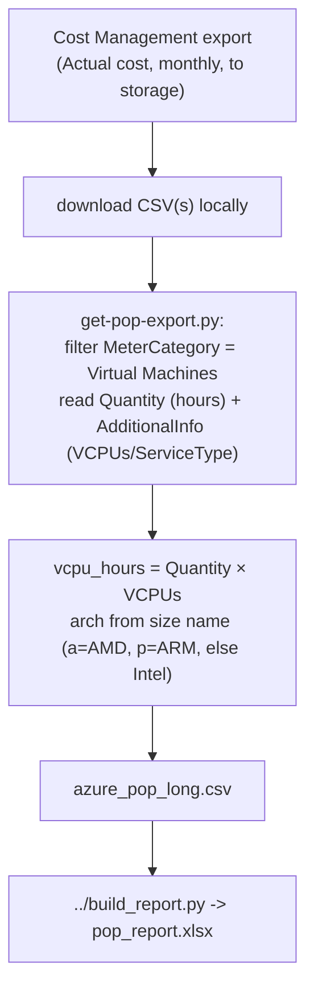

# Proof of Performance — Azure

Produces vCPU-hours per month/region/family for Azure VMs, classified as **Intel / AMD / ARM (Ampere)**, from an **Azure Cost Management export**.

> **Why an export and not a live query?** Unlike AWS (CUR) and GCP (BigQuery), Azure has no single billing table you can query for 12 months of region + VM-size + hours history. The Cost Management **export** is Azure's equivalent of the AWS CUR, and it's the reliable source. This is the one cloud where you must set up the export first — please validate the first run against your data.

## Output

A normalized CSV (`azure_pop_long.csv`):

```
cloud,year,month,region,arch,family,vcpu_hours
Azure,2025,8,eastus,AMD,D2as,1488
Azure,2025,8,eastus,Intel,D4s,2976
Azure,2025,9,westeurope,ARM,D2ps,1400
```

Then build the Excel with `../build_report.py` (sheet layout in the [top-level README](../README.md)).

## How the data flows



- **vCPU-hours** = `usage hours (Quantity) × vCPUs`. vCPUs come from the export's `AdditionalInfo` JSON (`"VCPUs"`), or, if absent, from a size→vCPU map built from `az vm list-skus`.
- **Arch** from the VM size (`AdditionalInfo.ServiceType`, e.g. `Standard_D2as_v5`): a `p` in the sub-family → ARM (Ampere), an `a` → AMD, else Intel.

## Prerequisites

- **A Cost Management export** (Actual cost, granularity that includes daily/monthly rows) written to a storage account. Setup guide:
  https://learn.microsoft.com/azure/cost-management-billing/costs/tutorial-improved-exports
  - Make sure the export schema includes **AdditionalInfo** (it does by default for the legacy usage export) so vCPUs/size are available.
- Azure CLI (`az`) — only needed if you build the size→vCPU map.
- `python3` (3.7+). `openpyxl` for the Excel step (`pip install --user openpyxl`).

## Step-by-step

1. **Create the export** (once) and let it run so you have ~12 months of CSVs, then download them to a local folder, e.g. `exports/`.
   - Backfill older months from the Portal: *Cost Management → Exports* (or *Cost analysis → Download*).
2. *(Optional but recommended)* build a size→vCPU map so any rows lacking an `AdditionalInfo.VCPUs` value can still be resolved:
   ```bash
   az vm list-skus --resource-type virtualMachines --all -o json > skus.json
   ```
3. **Run the parser:**
   ```bash
   python3 get-pop-export.py --exports "exports/*.csv" --skus skus.json -o azure_pop_long.csv
   ```
4. **Build the report:**
   ```bash
   python3 ../build_report.py azure_pop_long.csv -o pop_report.xlsx
   ```

### Options

| Flag | Purpose |
|------|---------|
| `--exports` | Glob for the export CSV file(s) (required), e.g. `"exports/*.csv"` |
| `--skus` | `az vm list-skus ... -o json` output, for size→vCPU lookup |
| `--vcpu-map` | Optional extra `size,vcpus` CSV to supplement the lookup |
| `-o/--output` | Normalized output path (default `azure_pop_long.csv`) |

The parser auto-detects column names across export schema variants (legacy vs FOCUS). It prints how many rows it used and how many it skipped for missing vCPU info.

## How to run — pick your environment

Good news: the Azure tool is **pure Python** (`get-pop-export.py` + `../build_report.py`), so unlike AWS/GCP it needs **no Bash** — it runs directly in Windows PowerShell too. You only need `python3`, plus `az` if you want to build the size→vCPU map. The one hard requirement is having the **Cost Management export CSVs** downloaded (see [Step-by-step](#step-by-step) above).

> Tip: `git clone` the repo so `../build_report.py` resolves correctly, and put your downloaded export CSVs in a folder like `exports/` inside `proof-of-performance/azure/`.

---

### Option A — Azure Cloud Shell (browser)

Cloud Shell has `az`, `python3`, and `git`, and you're auto-authenticated.

1. [portal.azure.com](https://portal.azure.com) → **Cloud Shell** icon (`>_`) → choose **Bash**.
2. ```bash
   git clone https://github.com/nfairoza/cloud-samples.git
   cd cloud-samples/proof-of-performance/azure
   pip install --user openpyxl
   ```
3. Upload your downloaded export CSVs (**Upload/Download files → Upload**) into an `exports/` folder here, then optionally build the SKU map:
   ```bash
   mkdir -p exports        # move the uploaded CSVs into this folder
   az vm list-skus --resource-type virtualMachines --all -o json > skus.json
   ```
4. Run:
   ```bash
   python3 get-pop-export.py --exports "exports/*.csv" --skus skus.json -o azure_pop_long.csv
   python3 ../build_report.py azure_pop_long.csv -o pop_report.xlsx
   ```
5. **Upload/Download files → Download** → `cloud-samples/proof-of-performance/azure/pop_report.xlsx`.

---

### Option B — Local Linux / macOS terminal

1. Install prerequisites (one time):
   ```bash
   python3 -m pip install --user openpyxl
   # az CLI (only for the SKU map): https://learn.microsoft.com/cli/azure/install-azure-cli
   ```
2. Authenticate (only if using `az`): `az login`
3. Run:
   ```bash
   git clone https://github.com/nfairoza/cloud-samples.git
   cd cloud-samples/proof-of-performance/azure
   # put your export CSVs in ./exports/
   az vm list-skus --resource-type virtualMachines --all -o json > skus.json   # optional
   python3 get-pop-export.py --exports "exports/*.csv" --skus skus.json -o azure_pop_long.csv
   python3 ../build_report.py azure_pop_long.csv -o pop_report.xlsx
   ```

---

### Option C — Windows (PowerShell or Command Prompt — no Bash needed)

1. Install [Python](https://www.python.org/downloads/windows/) (check **"Add python.exe to PATH"**) and, optionally, the [Azure CLI](https://learn.microsoft.com/cli/azure/install-azure-cli-windows).
2. Open **PowerShell** and run (note the `py` launcher and Windows path style):
   ```powershell
   py -m pip install --user openpyxl
   git clone https://github.com/nfairoza/cloud-samples.git
   cd cloud-samples\proof-of-performance\azure
   # put your export CSVs in .\exports\
   az vm list-skus --resource-type virtualMachines --all -o json > skus.json   # optional (requires az + az login)
   py get-pop-export.py --exports "exports/*.csv" --skus skus.json -o azure_pop_long.csv
   py ..\build_report.py azure_pop_long.csv -o pop_report.xlsx
   ```
   (In classic Command Prompt the same commands work; just use `python` instead of `py` if that's how Python is on your PATH.)

Because there's no shell script here, there are **no line-ending issues** to worry about on Windows.

## Get this data from the portal (no CLI)

Azure has **no instant portal query for vCPU-hours** (there's no billing table to query like Athena/BigQuery), but there are two useful portal paths:

### Option A — Cost analysis (quick migration eyeball; zero setup)
Shows the AMD-vs-Intel trend by VM series over time — no export, no script.
1. Portal → **Cost Management → Cost analysis**.
2. Set granularity to **Monthly**, range **Last 12 months**.
3. Add filter **Service name = Virtual Machines**.
4. **Group by = Meter subcategory** (e.g. `Dasv5 Series` = AMD, `Dsv5 Series` = Intel, `Dpsv5 Series` = ARM/Ampere).
5. Switch the chart to **Column (stacked)** and **Download**. You'll see the series mix shift month by month. This is cost/usage, not vCPU-weighted — for exact vCPU numbers use Option B.

### Option B — precise vCPU-hours (needs an export)
There's no portal shortcut for exact vCPU-hours on Azure. Set up a **Cost Management export** (see [Step-by-step](#step-by-step) above), then run `get-pop-export.py`. That's the only way to get true `hours × vCPUs` per region/family.

## Limitations & validation

- **Column names vary by export type.** The script handles the common legacy and FOCUS names; if your export uses different headers it will warn — send me the header row and I'll extend it.
- **Reserved Instances / Savings Plans**: usage hours are still attributed to the VM's size/vendor, which is what we want (vendor of the silicon).
- **Region** relies on the `ResourceLocation`/`Region` column in the export.
- If many rows are skipped for "no vCPU", pass `--skus skus.json` — some exports omit `AdditionalInfo.VCPUs`.

## Files
- `get-pop-export.py` — the Azure export parser
