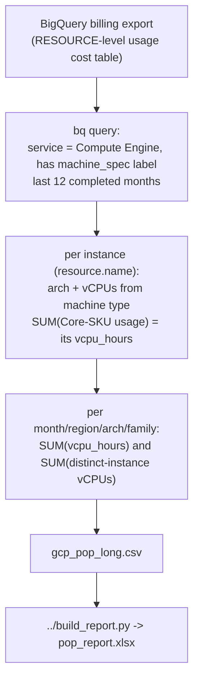

# Proof of Performance — GCP

Reads 12 months of Compute Engine usage from your **BigQuery billing export**, classifies each machine family as **Intel / AMD / ARM**, and produces both vCPU-hours and a real provisioned-vCPU count per month/region/family.

## How vCPUs are derived on GCP

- **vCPU-hours** — GCP prices compute **per vCPU** (the "Core" SKU) and per GB RAM separately. The Core SKU's `usage.amount_in_pricing_units` is already in **vCPU-hours**, so summing the Core SKUs gives it directly.
- **Provisioned vCPUs** (real count) — needs the machine size, which the Core SKU alone doesn't carry. The query reads the machine type from the `compute.googleapis.com/machine_spec` system label (resource-level export only), counts **distinct instances** (`resource.name`), and sums the vCPUs parsed from each machine type name (`n2d-standard-8` → 8). This is why the resource-level export is now required.

## Output

A normalized CSV (`gcp_pop_long.csv`):

```
cloud,year,month,region,arch,family,vcpu_hours,vcpus
GCP,2025,8,us-central1,AMD,n2d,50000,64
GCP,2025,8,us-central1,Intel,n2,120000,160
```

- **vcpu_hours** = `SUM(Core SKU usage)` — time-weighted consumption.
- **vcpus** = provisioned vCPUs = `SUM over distinct instances of (vCPUs parsed from machine type)`. A real count (instances × size), deduped by `resource.name`.

If `python3` + `openpyxl` are available, it also builds `pop_report.xlsx` (sheet layout in the [top-level README](../README.md)).

## How the data flows



- **Arch** is inferred from the machine type prefix: `t2a`/`c4a` → ARM; `n2d`/`c2d`/`t2d`/`c3d` → AMD; else Intel.
- **vCPUs per instance** are the integer in the machine type (`…-standard-8`, `…-highcpu-16`, `…-custom-8-…` → 8/16/8). Shared-core shapes (`e2-micro/small/medium`, `f1`, `g1`) carry no number and default to **2** — change `GCP_SHARED_CORE_VCPUS` at the top of the script if needed.
- **Window**: last **12 completed months** (current partial month excluded).

## Prerequisites

- Google Cloud SDK (`gcloud`, `bq`) installed and authenticated
- **Detailed usage cost (resource-level)** billing export to BigQuery configured — the `..._resource_v1_...` table. Required: the `machine_spec` label used for the provisioned vCPU count only exists in the resource-level export.
  https://cloud.google.com/billing/docs/how-to/export-data-bigquery-setup
- `roles/bigquery.dataViewer` + `roles/bigquery.jobUser`
- `python3` + `openpyxl` for the Excel step (optional)

## Configuration

Edit the top of `get-pop-export.sh`:

| Variable | Example | Meaning |
|----------|---------|---------|
| `PROJECT_ID` | `my-billing-project` | Project owning the billing dataset |
| `DATASET_NAME` | `billing_data` | BigQuery dataset with the export |
| `BILLING_TABLE` | `gcp_billing_export_resource_v1_XXXXXX_...` | The export table (find via `bq ls PROJECT:DATASET`) |
| `LONG_CSV` | `./gcp_pop_long.csv` | Normalized output |
| `REPORT_XLSX` | `./pop_report.xlsx` | Final Excel (if python3) |

> The **resource-level** (`..._resource_v1_...`) export is **required** — the standard export lacks the `machine_spec` label and `resource.name` this script needs for the provisioned vCPU count.

## How to run — pick your environment

`get-pop-export.sh` is a **Bash** script that uses `gcloud`/`bq`. The Excel step also needs **python3 + openpyxl**. Use whichever path matches where you are.

> Tip: the script calls `../build_report.py` (one level up). `git clone` the whole repo and run from inside the folder so that path just works.

---

### Option A — GCP Cloud Shell (easiest, nothing to install)

Cloud Shell already has `gcloud`, `bq`, `python3`, and `git`, and you're auto-authenticated.

1. Open [console.cloud.google.com](https://console.cloud.google.com) and click **Activate Cloud Shell** (`>_`, top-right).
2. Get the code and go to the folder:
   ```bash
   git clone https://github.com/nfairoza/cloud-samples.git
   cd cloud-samples/proof-of-performance/gcp
   pip install --user openpyxl        # for the Excel step
   ```
3. Point gcloud at the right project and edit the config block:
   ```bash
   gcloud config set project <YOUR_PROJECT_ID>
   nano get-pop-export.sh    # set PROJECT_ID / DATASET_NAME / BILLING_TABLE
   ```
4. Run it:
   ```bash
   chmod +x get-pop-export.sh
   ./get-pop-export.sh
   ```
5. Download the results with the Cloud Shell **⋮ (More) → Download** menu → enter the path shown at the end, e.g. `cloud-samples/proof-of-performance/gcp/pop_report.xlsx`.

---

### Option B — Local Linux / macOS terminal

1. **Install the prerequisites** (one time):
   ```bash
   # Google Cloud SDK (includes gcloud + bq): https://cloud.google.com/sdk/docs/install
   #   macOS:  brew install --cask google-cloud-sdk
   python3 -m pip install --user openpyxl
   ```
2. **Authenticate** (one time):
   ```bash
   gcloud auth login
   gcloud config set project <YOUR_PROJECT_ID>
   bq ls <YOUR_PROJECT_ID>:<DATASET>    # confirm you can see the billing dataset
   ```
3. **Get the code, configure, run:**
   ```bash
   git clone https://github.com/nfairoza/cloud-samples.git
   cd cloud-samples/proof-of-performance/gcp
   nano get-pop-export.sh      # edit the config block
   chmod +x get-pop-export.sh
   ./get-pop-export.sh
   ```
4. Output lands in the current folder: `gcp_pop_long.csv` and `pop_report.xlsx`.

---

### Option C — Windows

`.sh` scripts don't run in PowerShell/`cmd` directly. Use **one** of these:

**C1 — Git Bash**
1. Install [Git for Windows](https://git-scm.com/download/win), the [Google Cloud SDK](https://cloud.google.com/sdk/docs/install), and [Python](https://www.python.org/downloads/windows/) (check "Add to PATH").
2. Open **Git Bash**:
   ```bash
   pip install --user openpyxl
   gcloud auth login
   gcloud config set project <YOUR_PROJECT_ID>
   git clone https://github.com/nfairoza/cloud-samples.git
   cd cloud-samples/proof-of-performance/gcp
   nano get-pop-export.sh
   ./get-pop-export.sh
   ```

**C2 — WSL**: `wsl --install`, open Ubuntu, then follow **Option B**.

**C3 — No bash?** Use **Cloud Shell** (Option A).

> If you see `bad interpreter: ^M` (Windows line endings), run `sed -i 's/\r$//' get-pop-export.sh` and retry.

## Get this data from the portal (no CLI)

### Option A — BigQuery Studio (precise; needs billing export)
The portal equivalent of Athena — the easiest precise option on GCP.
1. Console → **BigQuery → Studio**.
2. Paste the `SELECT ... FROM \`project.dataset.table\`` query embedded in `get-pop-export.sh`, set your table name, and **Run**. It returns `cloud,year,month,region,arch,family,vcpu_hours,vcpus`.
3. **Save results → CSV** (or Google Sheets), then:
   ```bash
   python3 ../build_report.py <downloaded>.csv -o pop_report.xlsx
   ```

### Option B — Billing Reports (quick eyeball; zero query)
1. Console → **Billing → Reports**.
2. Filter **Service = Compute Engine**, and **SKU** contains `Core` (that usage *is* vCPU-hours).
3. **Group by = SKU**, range last 12 months, monthly. **Download CSV**.
4. The Core SKUs name the family (N2D/C2D = AMD, T2A/C4A = ARM, else Intel) — eyeball the vendor trend over time.

## Limitations

- **Resource-level export required.** Rows without a `machine_spec` label (e.g. non-resource exports, or usage that predates the resource-level export) are skipped — they have no machine size to count vCPUs from.
- **E2** shared-core / mixed-vendor families are reported as Intel (Google doesn't guarantee the vendor).
- **Shared-core vCPU default.** Types with no number in the name (`e2-micro/small/medium`, `f1-micro`, `g1-small`) are counted as `GCP_SHARED_CORE_VCPUS` (default 2). Adjust at the top of the script if your fleet has many of these.
- **Custom machine types** are read as the vCPU integer after `custom` (`n2-custom-8-16384` → 8); the family shows as `n2`.
- Sole-tenant and some GPU rows may not carry a Core SKU, so their `vcpu_hours` can be 0 even when the provisioned count is populated.
