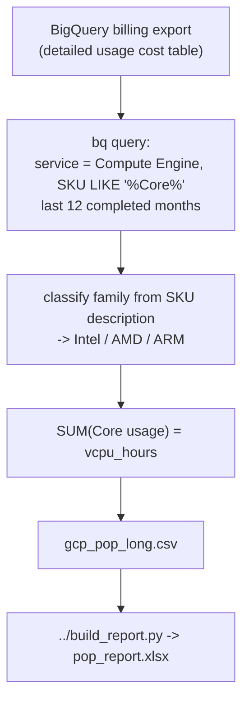

# Proof of Performance — GCP

Reads 12 months of Compute Engine **vCPU (Core) usage** from your **BigQuery billing export**, classifies each machine family as **Intel / AMD / ARM**, and produces vCPU-hours per month/region/family.

## Why this is clean on GCP

GCP prices compute **per vCPU** (the "Core" SKU) and per GB of RAM separately. The Core SKU's `usage.amount_in_pricing_units` is already measured in **vCPU-hours**, so we just sum the Core SKUs — no machine-size → vCPU lookup is needed.

## Output

A normalized CSV (`gcp_pop_long.csv`):

```
cloud,year,month,region,arch,family,vcpu_hours
GCP,2025,8,us-central1,AMD,n2d,50000
GCP,2025,8,us-central1,Intel,n2,120000
```

If `python3` + `openpyxl` are available, it also builds `pop_report.xlsx` (sheet layout in the [top-level README](../README.md)).

## How the data flows



- **Arch** is inferred from the SKU description: contains `arm`/`t2a`/`c4a` → ARM; contains `amd`/`n2d`/`c2d`/`t2d`/`c3d` → AMD; else Intel.
- **Window**: last **12 completed months** (current partial month excluded).

## Prerequisites

- Google Cloud SDK (`gcloud`, `bq`) installed and authenticated
- **Detailed usage cost** billing export to BigQuery configured:
  https://cloud.google.com/billing/docs/how-to/export-data-bigquery-setup
- `roles/bigquery.dataViewer` + `roles/bigquery.jobUser`
- `python3` + `openpyxl` for the Excel step (optional)

## Configuration

Edit the top of `get-pop-export.sh`:

| Variable | Example | Meaning |
|----------|---------|---------|
| `PROJECT_ID` | `my-billing-project` | Project owning the billing dataset |
| `DATASET_NAME` | `billing_data` | BigQuery dataset with the export |
| `BILLING_TABLE` | `gcp_billing_export_resource_v1_XXXXXX_...` | The export table (find via `bq ls PROJECT:DATASET`) |
| `LONG_CSV` | `./gcp_pop_long.csv` | Normalized output |
| `REPORT_XLSX` | `./pop_report.xlsx` | Final Excel (if python3) |

> The standard export works too, but the resource-level (`..._resource_v1_...`) export is recommended for accurate family attribution.

## How to run — pick your environment

`get-pop-export.sh` is a **Bash** script that uses `gcloud`/`bq`. The Excel step also needs **python3 + openpyxl**. Use whichever path matches where you are.

> Tip: the script calls `../build_report.py` (one level up). `git clone` the whole repo and run from inside the folder so that path just works.

---

### Option A — GCP Cloud Shell (easiest, nothing to install)

Cloud Shell already has `gcloud`, `bq`, `python3`, and `git`, and you're auto-authenticated.

1. Open [console.cloud.google.com](https://console.cloud.google.com) and click **Activate Cloud Shell** (`>_`, top-right).
2. Get the code and go to the folder:
   ```bash
   git clone https://github.com/nfairoza/cloud-samples.git
   cd cloud-samples/proof-of-performance/gcp
   pip install --user openpyxl        # for the Excel step
   ```
3. Point gcloud at the right project and edit the config block:
   ```bash
   gcloud config set project <YOUR_PROJECT_ID>
   nano get-pop-export.sh    # set PROJECT_ID / DATASET_NAME / BILLING_TABLE
   ```
4. Run it:
   ```bash
   chmod +x get-pop-export.sh
   ./get-pop-export.sh
   ```
5. Download the results with the Cloud Shell **⋮ (More) → Download** menu → enter the path shown at the end, e.g. `cloud-samples/proof-of-performance/gcp/pop_report.xlsx`.

---

### Option B — Local Linux / macOS terminal

1. **Install the prerequisites** (one time):
   ```bash
   # Google Cloud SDK (includes gcloud + bq): https://cloud.google.com/sdk/docs/install
   #   macOS:  brew install --cask google-cloud-sdk
   python3 -m pip install --user openpyxl
   ```
2. **Authenticate** (one time):
   ```bash
   gcloud auth login
   gcloud config set project <YOUR_PROJECT_ID>
   bq ls <YOUR_PROJECT_ID>:<DATASET>    # confirm you can see the billing dataset
   ```
3. **Get the code, configure, run:**
   ```bash
   git clone https://github.com/nfairoza/cloud-samples.git
   cd cloud-samples/proof-of-performance/gcp
   nano get-pop-export.sh      # edit the config block
   chmod +x get-pop-export.sh
   ./get-pop-export.sh
   ```
4. Output lands in the current folder: `gcp_pop_long.csv` and `pop_report.xlsx`.

---

### Option C — Windows

`.sh` scripts don't run in PowerShell/`cmd` directly. Use **one** of these:

**C1 — Git Bash**
1. Install [Git for Windows](https://git-scm.com/download/win), the [Google Cloud SDK](https://cloud.google.com/sdk/docs/install), and [Python](https://www.python.org/downloads/windows/) (check "Add to PATH").
2. Open **Git Bash**:
   ```bash
   pip install --user openpyxl
   gcloud auth login
   gcloud config set project <YOUR_PROJECT_ID>
   git clone https://github.com/nfairoza/cloud-samples.git
   cd cloud-samples/proof-of-performance/gcp
   nano get-pop-export.sh
   ./get-pop-export.sh
   ```

**C2 — WSL**: `wsl --install`, open Ubuntu, then follow **Option B**.

**C3 — No bash?** Use **Cloud Shell** (Option A).

> If you see `bad interpreter: ^M` (Windows line endings), run `sed -i 's/\r$//' get-pop-export.sh` and retry.

## Limitations

- **E2** shared-core / mixed-vendor families are reported as Intel (Google doesn't guarantee the vendor).
- Family is parsed from the SKU description text; unusual SKUs fall back to `other`.
- Sole-tenant and some GPU SKUs may not carry a "Core" line and are excluded.
